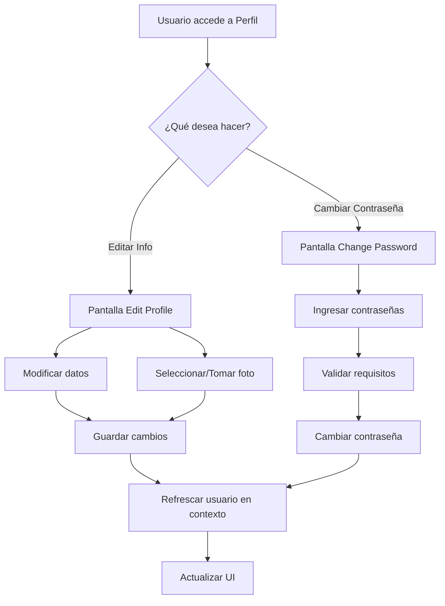

# 📝 Documentación - Edición de Perfil

## 🎉 Nuevas Funcionalidades Implementadas

Se ha implementado un sistema completo de gestión de perfil de usuario que permite:

### ✅ Funcionalidades Principales

1. **Editar Información Personal**
   - Cambiar nombre y apellido
   - Actualizar correo electrónico
   - Validaciones en tiempo real

2. **Gestión de Foto de Perfil**
   - Subir foto desde la galería
   - Tomar foto con la cámara
   - Eliminar foto de perfil
   - Vista previa antes de guardar
   - Soporte para múltiples formatos (JPG, PNG, etc.)

3. **Cambiar Contraseña**
   - Verificación de contraseña actual
   - Indicador de fuerza de contraseña
   - Validaciones de seguridad
   - Confirmación de nueva contraseña

---

## 📁 Archivos Creados/Modificados

### **Nuevos Archivos:**

1. **`src/services/userService.ts`**
   - Servicio para gestión de usuario
   - Métodos: updateProfile, updateProfileImage, deleteProfileImage, changePassword

2. **`app/(tabs)/edit-profile.tsx`**
   - Pantalla de edición de perfil
   - Selector de imágenes (galería/cámara)
   - Formulario de edición con validaciones

3. **`app/(tabs)/change-password.tsx`**
   - Pantalla de cambio de contraseña
   - Indicadores de requisitos de seguridad
   - Validación de contraseña actual

### **Archivos Modificados:**

1. **`src/contexts/AuthContext.tsx`**
   - Agregado método `refreshUser()` para actualizar datos desde el servidor

2. **`app/(tabs)/profile.tsx`**
   - Botones de acceso rápido (Editar Perfil, Cambiar Contraseña)
   - Visualización de foto de perfil
   - Enlaces a pantallas de edición

3. **`src/services/index.ts`**
   - Exportación del nuevo `userService`

---

## 🔌 Endpoints del Backend Utilizados

### **1. Obtener Perfil del Usuario**
```http
GET /api/organizer/profile
Authorization: Bearer {token}
```

**Respuesta:**
```json
{
  "success": true,
  "data": {
    "user_id": 1,
    "first_name": "Juan",
    "last_name": "Pérez",
    "email": "juan@example.com",
    "role": "participant",
    "profile_image": "/uploads/profiles/profile-123.jpg",
    "created_at": "2025-01-01T00:00:00.000Z"
  }
}
```

### **2. Actualizar Información del Perfil**
```http
PUT /api/organizer/profile
Authorization: Bearer {token}
Content-Type: application/json

{
  "first_name": "Juan Carlos",
  "last_name": "Pérez García",
  "email": "juancarlos@example.com"
}
```

### **3. Subir Imagen de Perfil**
```http
POST /api/organizer/profile-image
Authorization: Bearer {token}
Content-Type: multipart/form-data

FormData:
  - profileImage: [archivo de imagen]
```

**Respuesta:**
```json
{
  "success": true,
  "message": "Imagen de perfil actualizada exitosamente",
  "data": {
    "profile_image": "/uploads/profiles/profile-456.jpg"
  }
}
```

### **4. Eliminar Imagen de Perfil**
```http
DELETE /api/organizer/profile-image
Authorization: Bearer {token}
```

### **5. Cambiar Contraseña**
```http
PUT /api/organizer/change-password
Authorization: Bearer {token}
Content-Type: application/json

{
  "currentPassword": "contraseña_actual",
  "newPassword": "nueva_contraseña_segura"
}
```

---

## 🚀 Cómo Usar

### **1. Editar Perfil**

```typescript
// Desde cualquier componente
import { userService } from '@/src/services';

// Actualizar información
const result = await userService.updateProfile({
  first_name: 'Nuevo Nombre',
  last_name: 'Nuevo Apellido',
  email: 'nuevo@email.com',
});

if (result.success) {
  // Refrescar datos del usuario en el contexto
  await refreshUser();
}
```

### **2. Subir Imagen de Perfil**

```typescript
import * as ImagePicker from 'expo-image-picker';
import { userService } from '@/src/services';

// Seleccionar imagen
const result = await ImagePicker.launchImageLibraryAsync({
  mediaTypes: ImagePicker.MediaTypeOptions.Images,
  allowsEditing: true,
  aspect: [1, 1],
  quality: 0.8,
});

if (!result.canceled) {
  const imageUri = result.assets[0].uri;
  
  // Subir al servidor
  const uploadResult = await userService.updateProfileImage(imageUri);
  
  if (uploadResult.success) {
    await refreshUser();
  }
}
```

### **3. Cambiar Contraseña**

```typescript
import { userService } from '@/src/services';

const result = await userService.changePassword({
  currentPassword: 'actual123',
  newPassword: 'NuevaSegura123',
});

if (result.success) {
  console.log('Contraseña cambiada exitosamente');
}
```

### **4. Refrescar Datos del Usuario**

```typescript
import { useAuth } from '@/src/hooks';

const { refreshUser } = useAuth();

// Después de actualizar el perfil
await refreshUser();
```

---

## 🎨 Componentes de UI

### **EditProfileScreen**
- Formulario de edición con validaciones
- Selector de imagen con opciones:
  - 📷 Tomar foto
  - 🖼️ Elegir de galería
  - 🗑️ Eliminar foto
- Vista previa de imagen
- Indicador de carga durante subida

### **ChangePasswordScreen**
- Input de contraseña actual
- Input de nueva contraseña con indicador de fuerza
- Confirmación de contraseña
- Lista de requisitos con checkmarks
- Advertencias de seguridad

### **ProfileScreen (Actualizado)**
- Visualización de foto de perfil
- Botones de acción rápida:
  - ✏️ Editar Perfil
  - 🔒 Cambiar Contraseña
- Secciones clicables que redirigen a edición

---

## 🔒 Validaciones Implementadas

### **Validación de Nombres**
- Mínimo 2 caracteres
- Máximo 50 caracteres
- Solo letras, espacios y caracteres especiales permitidos

### **Validación de Email**
- Formato válido de email
- Verificación de disponibilidad (no usado por otro usuario)

### **Validación de Contraseña**
- Mínimo 8 caracteres
- Al menos una letra mayúscula
- Al menos una letra minúscula
- Al menos un número
- Contraseña nueva debe ser diferente de la actual

### **Validación de Imagen**
- Solo archivos de imagen (jpg, png, etc.)
- Tamaño máximo: 5MB
- Relación de aspecto 1:1 (cuadrado)

---

## 🔄 Flujo de Actualización



---

## 📱 Permisos Necesarios

### **iOS**
Agregar en `app.json`:
```json
{
  "expo": {
    "plugins": [
      [
        "expo-image-picker",
        {
          "photosPermission": "La aplicación necesita acceso a tus fotos para actualizar tu foto de perfil",
          "cameraPermission": "La aplicación necesita acceso a la cámara para tomar fotos de perfil"
        }
      ]
    ]
  }
}
```

### **Android**
Los permisos se manejan automáticamente por `expo-image-picker`.

---

## ⚠️ Manejo de Errores

### **Errores Comunes y Soluciones**

1. **"Email ya está en uso"**
   - El email ingresado pertenece a otro usuario
   - Solución: Usar un email diferente

2. **"Contraseña actual incorrecta"**
   - La contraseña actual no coincide
   - Solución: Verificar la contraseña ingresada

3. **"Solo se permiten archivos de imagen"**
   - Se intentó subir un archivo no válido
   - Solución: Seleccionar un archivo JPG, PNG o similar

4. **"Imagen muy grande"**
   - El archivo excede el límite de 5MB
   - Solución: Comprimir la imagen o seleccionar otra

5. **"No se pudo subir la imagen"**
   - Error de conexión o servidor
   - Solución: Verificar conexión a internet y reintentar

---

## 🧪 Testing

### **Casos de Prueba**

#### **Editar Perfil:**
- ✅ Cambiar nombre y apellido
- ✅ Cambiar email a uno válido y disponible
- ✅ Intentar usar email ya registrado (debe fallar)
- ✅ Subir foto desde galería
- ✅ Tomar foto con cámara
- ✅ Eliminar foto de perfil
- ✅ Validación de campos vacíos
- ✅ Validación de formato de email

#### **Cambiar Contraseña:**
- ✅ Cambiar con contraseña actual correcta
- ✅ Intentar con contraseña actual incorrecta (debe fallar)
- ✅ Nueva contraseña debe cumplir requisitos
- ✅ Confirmación debe coincidir
- ✅ Nueva contraseña debe ser diferente de la actual

#### **Refrescar Datos:**
- ✅ Datos se actualizan en toda la app
- ✅ Foto de perfil se muestra correctamente
- ✅ Persistencia después de cerrar y abrir la app

---

## 🎯 Características Destacadas

### **1. UX/UI Profesional**
- ✨ Diseño estilo iOS nativo
- 🎨 Soporte para modo claro y oscuro
- 📱 Adaptable a diferentes tamaños de pantalla
- 🔄 Animaciones suaves

### **2. Seguridad**
- 🔒 Validaciones robustas
- 🛡️ Verificación de contraseña actual
- 🔐 Indicador de fuerza de contraseña
- ✅ Confirmación de cambios importantes

### **3. Experiencia de Usuario**
- 🖼️ Vista previa de imagen antes de subir
- ⚡ Feedback instantáneo
- 💾 Auto-guardado de cambios
- 🔄 Sincronización automática

### **4. Manejo de Estados**
- 📊 Loading states
- ⚠️ Error handling
- ✅ Success messages
- 🔄 Pull to refresh

---

## 📚 Dependencias

### **Nueva Dependencia:**
```json
{
  "expo-image-picker": "~15.0.7"
}
```

**Instalación:**
```bash
npm install expo-image-picker
```

---

## 🔧 Configuración Adicional

### **Tipos TypeScript**

El servicio `userService` está completamente tipado:

```typescript
interface UpdateProfileData {
  first_name: string;
  last_name: string;
  email: string;
}

interface ChangePasswordData {
  currentPassword: string;
  newPassword: string;
}

interface ApiResponse<T = any> {
  success: boolean;
  message?: string;
  data?: T;
}
```

### **AuthContext**

Nuevos métodos disponibles:

```typescript
interface AuthContextType {
  // ... métodos existentes
  refreshUser: () => Promise<void>; // Nuevo
}
```

---

## ✅ Checklist de Implementación

- [x] Instalar expo-image-picker
- [x] Crear userService
- [x] Crear pantalla de edición de perfil
- [x] Crear pantalla de cambio de contraseña
- [x] Actualizar AuthContext con refreshUser
- [x] Actualizar pantalla de perfil
- [x] Agregar validaciones
- [x] Manejo de errores
- [x] Soporte para modo claro/oscuro
- [x] Documentación

---

## 🚀 Próximas Mejoras Sugeridas

1. **Optimización de Imágenes**
   - Compresión automática antes de subir
   - Múltiples tamaños (thumbnail, medium, full)

2. **Verificación de Email**
   - Enviar código de verificación al cambiar email
   - Confirmar antes de aplicar cambio

3. **Historial de Cambios**
   - Log de cambios de perfil
   - Auditoría de seguridad

4. **Configuración Avanzada**
   - Preferencias de notificaciones
   - Privacidad de perfil
   - Idioma de la app

5. **Redes Sociales**
   - Vincular cuentas sociales
   - Compartir perfil

---

## 📞 Soporte

Para reportar bugs o solicitar nuevas funcionalidades, contacta al equipo de desarrollo.

---

**¡Listo! 🎉 El sistema de edición de perfil está completamente implementado y documentado.**


